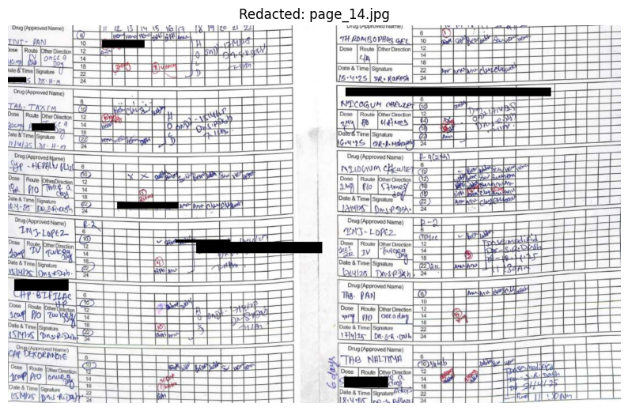
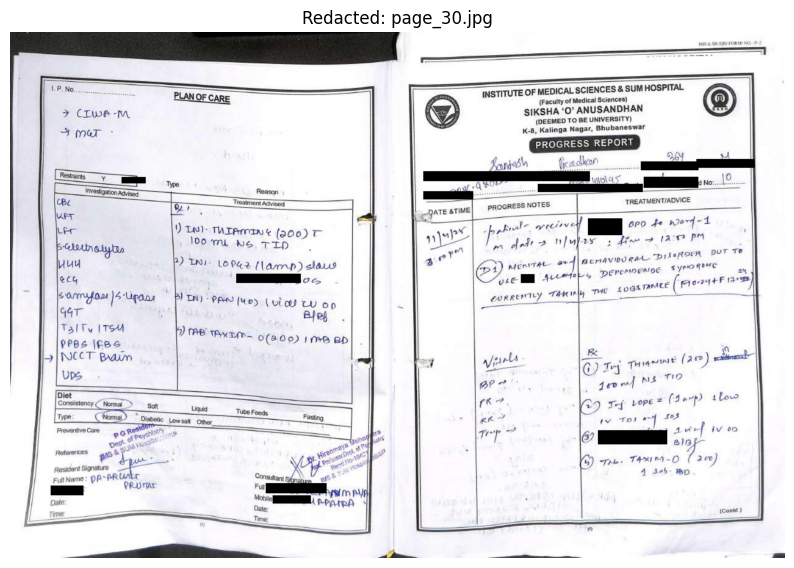

# OCR-PII-Extraction-Pipeline
An end-to-end OCR pipeline designed to process handwritten medical documents. It uses OpenCV and EasyOCR to extract text, clean it using fuzzy logic, and automatically redact sensitive PII (Patient Names, Doctor Signatures, Dates, and IDs).

---
# OCR Pipeline: Handwritten Document PII Extraction
 ---
##  Project Overview
This project is an end-to-end Optical Character Recognition (OCR) pipeline designed to process **handwritten medical documents**. The system takes raw JPEG images as input, performs image pre-processing to handle noise, extracts text using Deep Learning models, auto-corrects OCR errors, and automatically detects and redacts **Personally Identifiable Information (PII)**. It also generates a structured **JSON report** of the extracted data.

----

##  Objective
The goal was to build a robust solution that works on:
*   **Handwritten forms** (which are harder to read than printed text).
*   **Slightly tilted images** (common in mobile scans).
*   **Medical notes** containing sensitive data like Patient Names, Dates, Doctor Signatures, and IDs.

----

##  Tech Stack
*   **Language:** Python 3.x
*   **Image Processing:** OpenCV (`cv2`), NumPy
*   **OCR Engine:** EasyOCR (Deep Learning-based text recognition)
*   **Text Cleaning:** TheFuzz (Fuzzy Logic for auto-correction)
*   **Pattern Matching:** Regular Expressions (Regex)

----

## ✨ Key Features

### 1. Advanced Pre-processing
*   **Adaptive Thresholding:** Converts noisy, shadowed images into clean, high-contrast binary images, significantly improving OCR accuracy on handwriting.
*   **Contrast Enhancement:** Adjusts alpha/beta levels to make faint handwriting distinct from the paper background.

### 2. Deep Learning OCR
*   Utilizes **EasyOCR** to extract text coordinates (bounding boxes) and content. This was chosen over Tesseract for its superior performance on cursive and irregular handwriting.

### 3. Intelligent Text Cleaning
*   **Fuzzy Logic Auto-Correction:** Uses `thefuzz` library to fix common OCR typos in headers. For example, it automatically detects that "Palicnt" is actually "Patient Name" and standardized the output.

### 4. Context-Aware PII Redaction
Instead of simple keyword matching, the system uses intelligent logic:
*   **Dates:** Detects various formats (e.g., `15/4/25`, `15.04.2025`).
*   **Doctor Names:** Identifies signatures using prefixes (e.g., `Dr.`, `Dn.`, `Prof.`) while safely ignoring medical terms like "Drug" or "Dose".
*   **Dynamic Patient Name Redaction:** Recognizes headers like "Patient Name:" or "IPD No:" and **automatically expands the redaction box** to the right. This ensures the handwritten name/number next to the printed label is fully covered.

##  Project Structure
```text
OCR-Pipeline/
│
├── images/                         # Input folder for raw .jpg/.jpeg files
├── output/                         # Output folder for results
│   ├── extraction_report.json      # Structured data of extracted text & PII
│   └── redacted_*.jpg              # Images with black boxes over PII
├── OCR_Pipeline_Assignment.ipynb   # Jupyter Notebook (Visualization)
├── pipeline.py                     # Main source code script
├── requirements.txt                # List of dependencies
└── README.md                       # Project documentation
```

---
## Setup and Usage 

### 1. Install Dependencies
Make sure you have Python installed. Run the following command to install the required libraries:
```bash
pip install -r requirements.txt
```

### 2. Add Input Images
Place your handwritten document images (JPEG format) inside the **images/** folder.

### 3. Run the Pipeline
Execute the python script:
```bash
python pipeline.py
```
Alternatively, open **OCR_Pipeline_Assignment.ipynb** in VS Code/Jupyter to visualize the steps.

### 4. View Results
The script will process every image in the input folder. Check the **output/** directory for the results. 
**Images**: Check the output/ directory for files prefixed with redacted_.
**Data**: Check output/extraction_report.json to see the digitized text.

----
## Methodology (How it Works)

- **Image Loading:** Reads images from the input directory.
- **Pre-processing:** Applies contrast boosting and adaptive Gaussian thresholding to separate ink from paper texture.
- **Inference:** Uses EasyOCR to generate bounding boxes and detected text.
- **Cleaning:** Applies fuzzy string matching to correct misspelled headers  
  (e.g., `"Agc"` → `"Age"`).
- **Logic Filtering:** Iterates through each detected text element:
  - If it matches a **Date** (Regex) → **Redact**
  - If it matches a **Doctor prefix** (e.g., `Dr.`) → **Redact**
  - If it matches a **Header** (e.g., `"Patient Name"`) → **Redact** and **expand bounding box** horizontally
- **Drawing:** Uses OpenCV to draw solid black rectangles over redacted regions on the original image.
- **Export:** Saves the final redacted images and the JSON extraction report to the output directory.

---

##  Requirements
* opencv-python
* easyocr
* numpy
* thefuzz
* matplotlib

## Output samples

### Page_14


### Page_35


### Page_30

